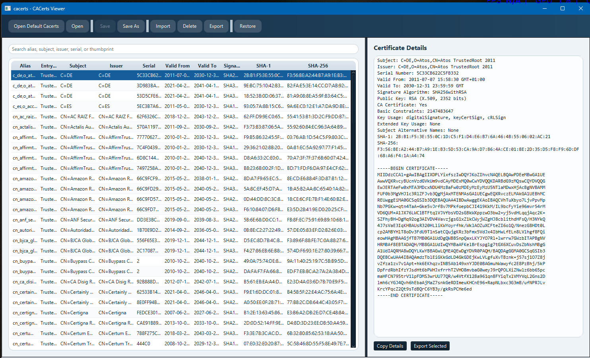

# CACerts Viewer


A lightweight JavaFX desktop tool for viewing and managing Java truststores without dropping to the `keytool` command line.

CACerts Viewer is designed for the common day-to-day workflow around Java `cacerts`, while also supporting regular `JKS` and `PKCS12` truststores. It is fully local, desktop-only, and built with minimal dependencies on top of the standard Java security APIs.



## Quick Start

```bash
mvn clean test
mvn javafx:run
```

To open the default Java truststore, use the app's `Open Default Cacerts` action. In many Java installations, the default `cacerts` password is:

```text
changeit
```

## Why This Exists

Managing Java truststores is often more awkward than it needs to be. This project provides a simple graphical interface for the most common tasks:

- Open and inspect truststores
- Search and review certificate metadata quickly
- Import and remove trusted certificates safely
- Save changes deliberately instead of modifying files immediately
- Create backups automatically before overwriting an existing store
- Restore a previous backup from the UI

## Features

### Truststore support

- Open Java `cacerts` files directly
- Open arbitrary `JKS` and `PKCS12` truststores
- Detect store type automatically where possible
- Prompt for truststore password securely
- Keep password handling in memory only as needed

### Certificate browsing

- View all truststore entries in a searchable, sortable table
- Inspect:
  - alias
  - entry type
  - subject
  - issuer
  - serial number
  - validity dates
  - signature algorithm
  - SHA-1 fingerprint
  - SHA-256 fingerprint
- Highlight expired and not-yet-valid certificates

### Certificate details

- Dedicated details panel for the selected certificate
- Show:
  - full subject DN
  - issuer DN
  - SANs when present
  - key usage
  - extended key usage
  - basic constraints / CA flag
  - public key summary
  - fingerprints
  - PEM/text view
- Copy details to the clipboard
- Export selected certificates as `.cer` or `.pem`
- Show a visual trust chain panel with issuer hierarchy and badges such as Trusted, Missing issuer, Self-signed, and Root in store`r`n- Show chain-building diagnostics, likely issuer matches, and trust-anchor information

### Editing and safety

- Import certificate files via file picker
- Drag and drop support for certificate imports
- Alias prompt and duplicate alias handling
- Delete certificates with confirmation
- Track unsaved changes in memory
- `Save` and `Save As` support
- Warn before closing when changes are unsaved

### Backup and restore

- Automatically create a timestamped backup before overwriting an existing truststore
- Store backups in a local `.cacertsviewer-backups` folder beside the original truststore
- Browse available backups from the UI
- Restore a selected backup with confirmation

## Technology Stack

- Java 21
- JavaFX 21
- Maven
- JUnit 5
- Standard Java security APIs (`KeyStore`, `X509Certificate`, `CertificateFactory`)

## Project Structure

```text
src/
  main/
    java/
      com/example/cacertsviewer/
        model/
        service/
        ui/
        util/
    resources/
      styles/
  test/
    java/
      com/example/cacertsviewer/service/
screenshot/
  truststoreviewer.png
```

## Prerequisites

- Java 21 LTS
- Maven 3.9 or newer
- A desktop environment capable of running JavaFX applications

## Getting Started

### Run in development

```bash
mvn clean javafx:run
```

### Run tests

```bash
mvn clean test
```

### Package a runtime image

```bash
mvn clean javafx:jlink
```

## Packaging

### Build a native app image with `jpackage`

After generating the runtime image, package the modular application with:

```bash
jpackage ^
  --type app-image ^
  --dest dist ^
  --name CACertsViewer ^
  --runtime-image target\cacertsviewer-runtime ^
  --module com.example.cacertsviewer/com.example.cacertsviewer.CacertsViewerApp
```

For a Windows installer, change `--type app-image` to `exe` once the required packaging tools are installed.

## Supported Formats

### Truststores

- `JKS`
- `PKCS12` (`.p12`, `.pkcs12`, `.pfx`)
- Java `cacerts`

### Certificate imports

- `.cer`
- `.crt`
- `.pem`
- `.der`

### Certificate exports

- `.cer`
- `.pem`

## Safety Notes

- The app does not auto-write changes on every action
- Destructive actions require confirmation
- Existing truststores are backed up before overwrite by default
- The application does not attempt privilege escalation
- If write access fails, the app reports the error rather than forcing the operation

## Known Notes

- This first pass is focused on truststore certificate entries rather than complex private-key keystore workflows
- Store type detection is based on extension heuristics plus load attempts
- Public key size display is a lightweight summary and may be approximate for some algorithms
- On some Java 21 environments, JavaFX may print a startup warning about `sun.misc.Unsafe::allocateMemory`; this comes from JavaFX internals and is non-fatal for normal local use

## Roadmap Ideas

- Recent files and lightweight preferences
- CSV export of certificate lists
- Bulk import improvements
- Optional theme variants

## License

This project is licensed under the MIT License. See [LICENSE](LICENSE).